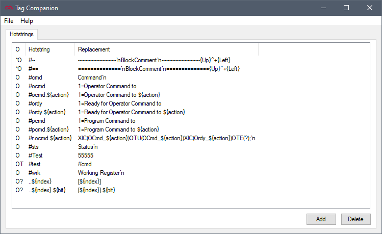
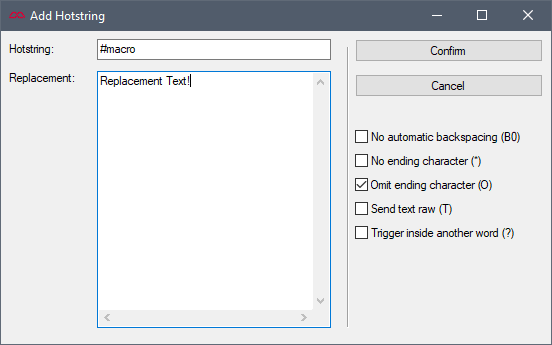
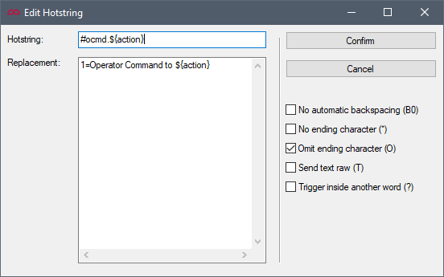
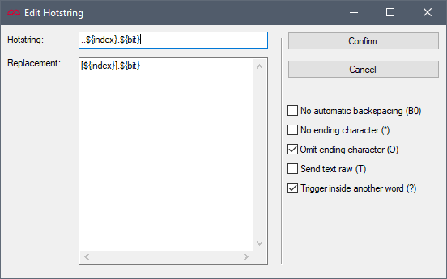

# Tag Companion [][TagCompanion]

[](https://github.com/mussonindustrial/TagCompanion/actions/workflows/msi.yml)

A Windows tool for faster and easier Studio5000 tag creation.

[](docs/home.png)

## Getting Started
1. Download the latest version from [releases].
2. Run the installer.

### Hotstring Engine
The Hotstring Engine allows you to define text replacement macros.
When the engine detects that a macro has been typed followed by a whitespace character, the macro text will be deleted and the replacement value will be inserted.

#### Simple Replacement
[](docs/hotstring_example1.png)

In the above example, typing `#macro{Space}` will cause `Replacement Text!` to be inserted instead.
```text Example 1
; Example 1 - Simple Replacement
Input: #macro{Space}
Output: Replacement Text!
```


#### Macro Variables
Simple replacement can be very handy on its own, but the real power comes from macro variables.
Macro variables allow you to parameterize the context of the replacement text.

Any variables in the following form will be recognized:
```js
${variable}
```
[](docs/hotstring_example2.png)

In the above example, typing `#ocmd.Start{Space}` will cause `1=Operator Command to Start` to be inserted instead.

```text Example 2
; Example 2 - Macro Variables
Input: #ocmd.Start{Space}
Output: 1=Operator Command to Start
```

#### More Macro Variables 
You can use as many variables as you want in your macros.
The following example demonstrates a macro for quick bit indexing of a DINT array:
[](docs/hotstring_example3.png)

In the above example, typing `..4.10{Space}` will cause `[4].10` to be inserted instead.
The optional (?) flag is enabled to allow detection of the macro inside of another word.

```text Example 3
; Example 3 - More Macro Variables
Input: ..4.10{Space}
Output: [4].10

; This only works because of the (?) flag.
Input: MyDINTArray..4.10{Space}
Output: MyDINTArray[4].10
```


## TODO

- [X] Hotstring Engine
- [X] Windows MSI Installer
- [ ] Tag Description Suggestions
- [ ] Online Tag Import Macro
- [ ] Macro Variable Syntax Highlighting

## Copyright and Licensing

Copyright (C) 2024 Musson Industrial.

Free use of this software is granted under the terms of the GPLv3 License.

[TagCompanion]: https://github.com/mussonindustrial/TagCompanion
[releases]: https://github.com/mussonindustrial/TagCompanion/releases
[documentation]: https://docs.mussonindustrial.com/
